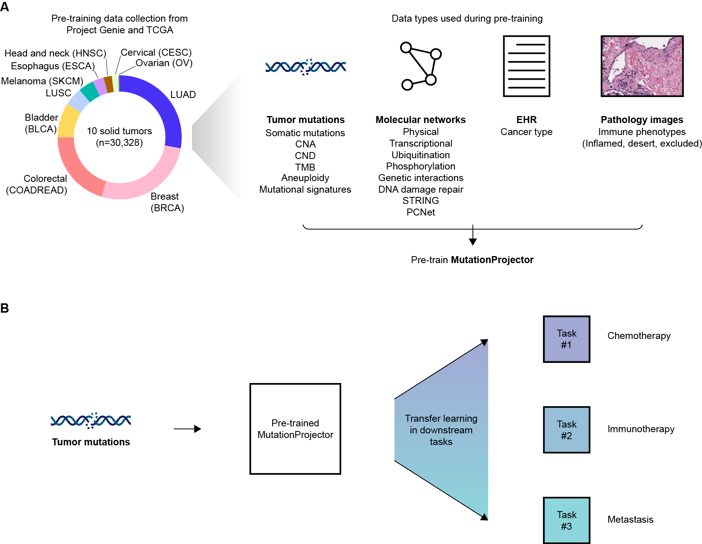
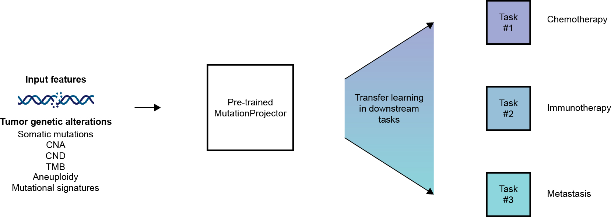

# MutationProjector
MutationProjector is a neural network that translates clinical gene panels into a foundational representation of tumor subtypes. This is a tumor mutation-based foundation model capable of predicting cancer therapeutic response and metastatic potential in cancer, in which multiple types of molecular interaction networks were incorporated into the model. 

## Pre-training MutationProjector
To pre-train MutationProjector, we leveraged large-scale genomic alteration data, histopathology images and multiple molecular interaction networks. Simplified overview of the approach is visualized below:


## Environment set up
MutationProjector require the following environmental setup:
- GPU server with CUDA>=11 installed
- Python >= 3.6
- Anaconda: [conda](https://docs.conda.io/projects/conda/en/latest/user-guide/install/)
- PyTorch (ver 2.1.2 was used in the manuscript)
- To install all dependencies, use the below command:
`conda env create -f conda-envs/env.yml`

## Protein interaction graphs
Protein interaction graphs are available in `/data/networks`.  
All of the networks used in this study are available on NDEx (Network Data Exchange).
- DNA Damage Repair: [DDRAM](https://www.ndexbio.org/viewer/networks/748395aa-0abd-11ec-b666-0ac135e8bacf)
- all other networks (7 networks in total): [MutationProjector NDEx](https://www.ndexbio.org/#/networkset/c84a818c-252c-11f0-9806-005056ae3c32?accesskey=503563dfc8742d58e96b755a1355978a0ca8a9d4737bfd403fc2ebabe51780e3)


## Other requirements
- Calculate tumor mutation burden: use [Maftools](https://www.bioconductor.org/packages/release/bioc/html/maftools.html)
- Calculate aneuploidy: use [ASCETS](https://github.com/beroukhim-lab/ascets)
- Calculate mutational signatures from targeted gene panels: use [MESiCA](https://pmc.ncbi.nlm.nih.gov/articles/PMC11228799/)
- Calculate mutational signatures from whole exome/genome sequencing: use [SigProfiler](https://cancer.sanger.ac.uk/signatures/tools/)


## Required input files for downstream tasks
Make sure to create a folder under `/data/downstream_data/train_dataset` and/or `/data/downstream_data/eval_dataset`, dependeing on your task requirements.
Also, make sure that you have all the tab-delimited files under the folder created above. 
1. *mut.txt*
2. *cna.txt*
3. *cnd.txt*
4. *covariates.txt*
5. *outcomes.txt* [OPTIONAL]  

Provide `outcomes.txt` file if trying to transfer learn on specific task or dataset. Include two columns, `sample` and `outcomes`. `outcomes` column should contain binary outcome label (either 0 or 1). 

Example files are under ./data/downstream_data/sample folder (note that this is a synthetic data).


### Codes for generating the input files for TMB, aneuploidy and mutational signatures
All codes related to generating the input files for TMB and mutational signatures are available under `./src` folder.
For generating aneuploidy, please use [ASCETS](https://github.com/beroukhim-lab/ascets)
1. *calculate_TMB.R* : calculates TMB from MAF (Mutation Annotation Format) files using [Maftools](https://www.bioconductor.org/packages/release/bioc/html/maftools.html)
2. *mutation_signatures-compute_SBS.py* : compute mutation signatures from MAF files using [SigProfiler](https://cancer.sanger.ac.uk/signatures/tools/)
3. *mutation_signatures-identify_dominant_signature.py* : compute dominant mutation signatures


## Making predictions using the pre-trained MutationProjector


### (A) Predictions using the transfer-learned models
To use transfer-learned models for immunotherapy/chemotherapy response, metastasis or tissue-of-origin prediction, execute the following:


#### 1. Prepare test dataset  
Make sure you have all the *mut.txt*, *cna.txt*, *cnd.txt*, *covariates.txt* and *outcomes.txt* files under `/data/downstream_data/eval_dataset/{your_dataset_name}`  
(please change {your_dataset_name} to the desired name)


#### 2. Run the model in a GPU server by executing the following in the `/src` folder:  
```bash
python predict.py 
		   -downstream_eval 
		   -transfer_learned_model
		   -o [OPTIONAL]  
		   -padding_idx [OPTIONAL]
```
Arguments  
- `-downstream_eval`  
Name of the folder containing the downstream dataset to predict
- `-transfer_learned_model`  
Choose one of the following
    - `Chemotherapy` (for chemotherapy response prediction)
	- `Immunotherapy` (for immunotherapy response prediction)
	- `metastasis_luad` (for metastasis prediction in lung adenocarcinoma patients)
	- `tissue_of_origin_BRCA` (for predicting the probability of a recurrent/metastatic tumor originating from breast cancer)
	- `tissue_of_origin_COADREAD` (for predicting colorectal cancer origin probability)
	- `tissue_of_origin_LUAD` (for predicting lung adenocarcinoma origin probability)
	- `tissue_of_origin_LUSC` (for predicting lung squamous cell carcinoma origin probability)
- `-o` 
Output file prefix (optional).
- `--padding_idx`
List of indices for missing values in the covariates (optional). 


#### 3. Output files 
- Predicted probabilities for each tumor samples  
- Output file available at:  
`/prediction_results/{your_dataset_name}/TransferLearning_predictions.txt`


### (B) Transfer learning on your own downstream tasks
To make predictions for the task of your interest using the pre-trained MutationProjector, execute the following:
#### 1. Prepare train and test datasets
Make sure you have all the *mut.txt*, *cna.txt*, *cnd.txt*, *covariates.txt* and *outcomes.txt* files under `/data/downstream_data/train_dataset/{your_dataset_name}` and `/data/downstream_data/eval_dataset/{your_dataset_name}`  
(please change {your_dataset_name} to the desired name)


#### 2. Run the model in a GPU server by execute the following in the `/src/` folder:  
```bash
python predict.py 
		   -downstream_train 
		   -downstream_eval
		   -max_depth [OPTIONAL] 
		   -n_estimators [OPTIONAL] 
		   -o [OPTIONAL]  
		   -padding_idx [OPTIONAL]
```
Arguments  
- `-downstream_train`  
Name of the folder containing the downstream dataset to train
- `-downstream_eval`  
Name of the folder containing the downstream dataset to test
- `-max_depth`  
Hyperparameter for random forest (optional).
- `-n_estimators`
Hyperparameter for random forest (optional).
- `-o` 
Output file prefix (optional).
- `--padding_idx`
List of indices for missing values in the covariates (optional). 


#### 3. Output files 
- Predicted probabilities for each tumor samples  
- Output file available at:  
`/prediction_results/{your_dataset_name}/TransferLearning_predictions.txt`


## Code used for pre-training
MutationProjector is pre-trained using self-supervised learning and supervised learning. 
The code for pre-training is `/src/pretrain.py`.


## Cite
Please cite the **MutationProjector** paper if using this repo:
### 1. `MutationProjector`  
- *bioRxiv*: Kong, JungHo, et al. "Translating clinical gene sequencing into a foundational representation of tumor subtype." bioRxiv (2025): 2025-09.  

If using protein interaction graphs or other tools, please cite the papers below:  
### 2. `Networks`
- *BioPlex*: Huttlin, E. L. et al. Dual proteome-scale networks reveal cell-specific remodeling of the human interactome. Cell 184, 3022–3040.e28 (2021)
- *SIGNOR*: Lo Surdo, P. et al. SIGNOR 3.0, the SIGnaling network open resource 3.0: 2022 update. Nucleic Acids Res 51, D631–D637 (2023)
- *SignaLink*: Csabai, L. et al. SignaLink3: a multi-layered resource to uncover tissue-specific signaling networks. Nucleic Acids Res 50, D701–D709 (2022)
- *TRRUST v2*: Han, H. et al. TRRUST v2: an expanded reference database of human and mouse transcriptional regulatory interactions. Nucleic Acids Res 46, D380–D386 (2018)
- *PhosphoSitePlus*: Hornbeck, P. V. et al. PhosphoSitePlus: a comprehensive resource for investigating the structure and function of experimentally determined post-translational modifications in man and mouse. Nucleic Acids Res 40, D261–70 (2012)
- *UbiNet v2.0*: Li, Z. et al. UbiNet 2.0: a verified, classified, annotated and updated database of E3 ubiquitin ligase-substrate interactions. Database (Oxford) 2021, (2021)
- *UbiBrowser v2.0*: Wang, X. et al. UbiBrowser 2.0: a comprehensive resource for proteome-wide known and predicted ubiquitin ligase/deubiquitinase-substrate interactions in eukaryotic species. Nucleic Acids Res 50, D719–D728 (2022)
- *ISLE*: Lee, J. S. et al. Harnessing synthetic lethality to predict the response to cancer treatment. Nat Commun 9, 2546 (2018)
- *SynLethDB v2.0*: Wang, J. et al. SynLethDB 2.0: a web-based knowledge graph database on synthetic lethality for novel anticancer drug discovery. Database (Oxford) 2022, (2022)
- *DDRAM*: Kratz, A. et al. A multi-scale map of protein assemblies in the DNA damage response. Cell Syst 14, 447–463.e8 (2023)
- *PCNet v1.3*: Huang, J. K. et al. Systematic Evaluation of Molecular Networks for Discovery of Disease Genes. Cell Syst 6, 484–495.e5 (2018)
- *STRING v12*: Szklarczyk, D. et al. The STRING database in 2023: protein-protein association networks and functional enrichment analyses for any sequenced genome of interest. Nucleic Acids Res 51, D638–D646 (2023)  
### 3. `Network data repository`
- *NDEx*: Pratt, D. et al. NDEx, the Network Data Exchange. Cell Syst 1, 302–305 (2015)  
### 4. `tumor mutation burden`
- *Maftools*: Mayakonda, A., Lin, D.-C., Assenov, Y., Plass, C. & Koeffler, H. P. Maftools: efficient and comprehensive analysis of somatic variants in cancer. Genome Res. 28, 1747–1756 (2018)  
### 5. `aneuploidy`
- *ASCETS*: Spurr, L. F. et al. Quantification of aneuploidy in targeted sequencing data using ASCETS. Bioinformatics 37, 2461–2463 (2021)  
### 6. `mutational signatures (targeted sequencing)`
- *MESiCA*: Yaacov, A. et al. Cancer mutational signatures identification in clinical assays using neural embedding-based representations. Cell Rep Med 5, 101608 (2024)  
### 7. `mutational signatures (whole exome/genome sequencing)`
- *SigProfiler*: Alexandrov, L. B. et al. The repertoire of mutational signatures in human cancer. Nature 578, 94–101 (2020)
